<!-- This gives the ability to provide 'back to the top links -->
<a name="readme-top"></a>

<!-- Account LOGO -->
<br />
<div align="center">
  <a href="https://github.com/ProfCyberNaught">
    
  </a>
</div>

Detailed Instructions - Copying a Cybersecurity Article
=======================================================

This more detailed set of instructions has been created to assist those whom might need further instructions to help create a backup copy of a Cybersecurity Blog Article taken from the [main website](https://profcybernaught.hashnode.dev/ "Cybersecurity Blog - ProfCyberNaught").

You will find screenshots of the different sections using an example main website article post, screenshots of the `blank_article_layout_template.md` file, along with the locations for each data type, and example results for those sections.

**What will this detailed contribution instructions cover:**

This more detailed set of instructions aims to cover the main step called `USING THE BLANK ARTICLE TEMPLATE FILE - STEP 2` over on the main [CONTRIBUTING.md file](./CONTRIBUTING.md "Contributing to the Cybersecurity Blog Article Backup Repository - ProfCyberNaught"). We suggest having the main steps open along side this detailed set of instructions. Both documents are aimed at helping you achieve your first contribution to a GitHub repository.

Copying the Article Content
===========================

Make sure you have already chosen which Cybersecurity blog article you would like to create a backup copy of: `CHOOSING AN ARTICLE`. Make sure you have checked the `MAKE AN ARTICLE COPY` issue for comments that might have already stated, somebody is copying this blog article.

Double check the issue: [MAKE AN ARTICLE COPY](# "Make an Article Copy - Cybersecurity Blog - Beginner Friendly Issue - GitHub - ProfCyberNaught")
<br /><br />

<!-- TABLE OF CONTENTS -->
#### Table of Contents
  <ol>
  <!-- HELP NOTICE: If you need more links, copy and paste from this list, create your section below, then add the section link tag
       Do not forget to update all the tag links if you change names of the sections below -->
    <li><a href="#assumptions-made">Assumptions Made</a></li>
    <li><a href="#the-article-title">Article Title</a></li>
    <li><a href="#the-article-subtitle">Article Subtitle</a></li>
    <li><a href="#the-article-content">Article Content</a></li>
        <ol>
            <li><a href="#bold-text">Bold Text</a></li>
            <li><a href="#italic-text">Italic Text</a></li>
            <li><a href="#mixing-bold-and-italic-text">Mixing Bold & Italic</a></li>
            <li><a href="#underlined-text">Underlined Text</a></li>
            <li><a href="#headings-text">Headings</a></li>
            <li><a href="#new-paragraphs">Paragraphs</a></li>
            <li><a href="#line-breaks-text">Line Breaks</a></li>
            <li><a href="#blockquote-text">Blockquotes</a></li>
            <ol>
                <li><a href="#blockquotes-with-multiple-paragraphs">Blockquotes with Multiple Paragraphs</a></li>
                <li><a href="#nested-blockquotes">Nested Blockquotes</a></li>
                <li><a href="#blockquotes-with-other-elements">Blockquotes with Other Elements</a></li>
            </ol>
            <li><a href="#ordered-list-text">Ordered Lists</a></li>
            <li><a href="unordered-list-text">Unordered Lists</a></li>
            <li><a href="#programming-code-text">Programming Code Snippets</a></li>
            <li><a href="#displaying-images">Displaying Images</a></li>
            <li><a href="#escaping-backticks-text">Escaping Backticks</a></li>
            <li><a href="#horizontal-rules-lines--dividers">Horizontal Rule (Divider Lines)</a></li>
            <li><a href="#adding-links">Adding Links</a></li>
            <li><a href="#escaping-characters">Escaping Special Characters</a></li>
            <li><a href="#using-tables">Using Tables</a></li>
        </ol>
    <li><a href="#the-article-keywords">Article Keywords</a></li>
    <li><a href="#the-article-references-further-reading">Article References (Further Reading)</a></li>
    <li><a href="#the-blank-template-footer-table">Blank Template Footer Table</a></li>
        <ol>
            <li><a href="#setting-the-published-date-variable">Setting the [PUBLISHED-DATE]</a></li>
            <li><a href="#setting-the-article-title-here-variables">Setting the [ARTICLE-TITLE-HERE]</a></li>
            <li><a href="#setting-the-copied-over-date-variable">Setting the [COPIED-OVER-DATE]</a></li>
            <li><a href="#setting-the-article-title-url-variable">Setting the [ARTICLE-TITLE-URL]</a></li>
            <li><a href="#setting-the-your-github-username-variables">Setting the [YOUR-GITHUB-USERNAME]</a></li>
            <li><a href="#setting-the-your-github-url-variable">Setting the [YOUR-GITHUB-URL]</a></li>
        </ol>
    <li><a href="#do-not-edit-above-or-below-sections">Do Not Edit Above Below Sections</a></li>
    <li><a href="#next-steps">Next Steps</a></li>
    <li><a href="#support">Need Support?</a></li>
    <li><a href="#code-of-conduct">Code of Conduct</a></li>
  </ol>
<br /><br />

### Assumptions Made
We make the following assumptions about you:

- You can speak English as per these instructions
- You have registered for a GitHub account already
- You are logged into your account via your chosen internet browser
- You have read the additional information presented in the links below _(or at least will refer to it if required)_
- You are familiar enough with your chosen operating system _(Windows, MacOS, Linux)_
- You understand how to copy and paste data
- You already have a text editor or _(IDE - Integrated Development Environment)_ code editor installed
- You have Git, Github, GitHub Desktop installed or are using the web client interface
- You have an active internet connection to view the main Cybersecurity website

**IDE Suggestion:**<br />
We suggest using an official code editor such as VSCodium, VSCode, Notepad++, Sublime Text and more. However, a standard text editor such as `Notepad(Windows)`, `GEdit(Linux)` or `TextEdit(MacOS)` will work just fine. Be careful about adding text formating and saving as a different file type _(must be `.md`)_.<br />

We use Markdown for these pages and a link has been provided below with more additional instructions and examples. However, <ins>**we have documented in extensive detail many of the options available in Markdown**</ins>.

**_PRIVACY ADVISORY NOTICE:_**
<br />_**VSCode** has <ins>Microsoft telemetry activated by default</ins>. You can turn this off in the File > Options window. **VSCodium** <ins>does not</ins> have the Microsoft telemetry activated by default. Both are based on open-source software and free to use._<br />

_**GitHub Desktop** also has <ins>Microsoft telemetry activated by default</ins>. This can also be disabled in the settings: File > Options > Advanced > Usage. This is also open-source software, although GitHub itself is closed-source._
<br /><br />

    Unfortunately, there are other telemetry behaviours within your chosen operating system and/or software packages installed. Make sure you do your own research if you value your privacy like we do.
<br />

**NOT SURE HOW TO USE GITHUB DESKTOP OR CLIENT COMMANDS?**

If you are not familiar with `Markdown Syntax`, please follow this link for further details: [Basic Syntax - Markdown Guide](https://www.markdownguide.org/basic-syntax/ "Basic Syntax - Markdown Guide")

If you are not familiar with `Markdown Emojis`, please follow this link for further details: [Markdown Emojis - Shortcut Codes](https://github.com/ProfCyberNaught/markdown-emojis "Markdown Emojis - Shortcut Codes")

If you are not familiar with `GitHub Desktop`, please follow this link for further details: [GitHub Desktop - Usage Instructions](https://docs.github.com/en/desktop/installing-and-configuring-github-desktop/overview/getting-started-with-github-desktop "GitHub Desktop - Usage Instructions")

If you prefer to learn the `GitHub Client commands`, please follow this link for further details: [GitHub Usage Instructions](https://docs.github.com/en/repositories/creating-and-managing-repositories/cloning-a-repository "GitHub Usage Instructions")

<br /><br />
**Please use the below instructions to copy the article content:**
<br /><br />

For the purpose of this detailed documentation, we have selected to use a particular Cybersecurity article called: `Not Everything is a 'Click Fix'!`. An example of what this article looks like in the main Cybersecurity website feed has been provided below:

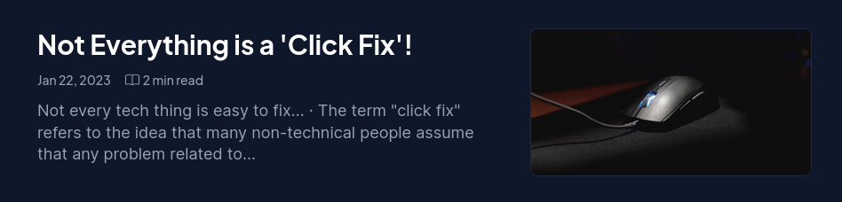

To view this article, you can click the following link: [View Article](https://profcybernaught.hashnode.dev/not-everything-is-a-click-fix "Not Everything is a 'Click Fix'! - Cybersecurity Blog - ProfCyberNaught")

We have also used another article for the reference section because the one linked above, does not contain any references. You can view this Cybersecurity article called `An Overview of Leet (1337) Speak: History, Usage, and Implications` by clicking the following link: [View Article](https://profcybernaught.hashnode.dev/an-overview-of-leet-1337-speak-history-usage-and-implications "An Overview of Leet (1337) Speak: History, Usage, and Implications - Cybersecurity Blog - ProfCyberNaught")
<br /><br />

#### THE ARTICLE TITLE
The article title can be found at the very top of the main article website page. The below image displays the top of an article page named: `Not Everything is a 'Click Fix'!`. [View Article](https://profcybernaught.hashnode.dev/not-everything-is-a-click-fix "Not Everything is a 'Click Fix'! - Cybersecurity Blog - ProfCyberNaught")

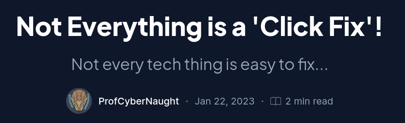

You can copy the title text and paste this into the `blank template file` title section displayed in the image below:

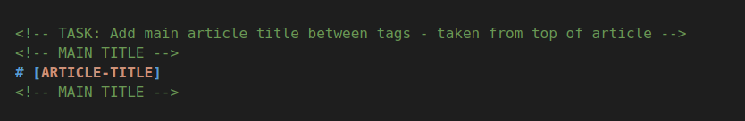

Replace `[ARTICLE-TITLE]` with the copied title text:

```
# Not Everything is a 'Click Fix'!
```

<br /><br />

#### THE ARTICLE SUBTITLE
The article subtitle can be found directly underneath the main article title. The below image displays the top of an article page named: `Not Everything is a 'Click Fix'!`. [View Article](https://profcybernaught.hashnode.dev/not-everything-is-a-click-fix "Not Everything is a 'Click Fix'! - Cybersecurity Blog - ProfCyberNaught")


You can copy the subtitle text and paste this into the `blank template file` subtitle section displayed in the image below:

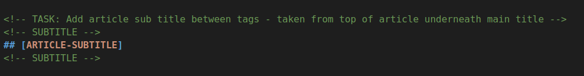

Replace `[ARTICLE-SUBTITLE]` with the copied title text:

```
## Not every tech thing is easy to fix...
```
<br /><br />

#### THE ARTICLE CONTENT
The article body content can be found directly underneath the header section detailed above. The below image displays the main body content from the article page named: `Not Everything is a 'Click Fix'!`. [View Article](https://profcybernaught.hashnode.dev/not-everything-is-a-click-fix "Not Everything is a 'Click Fix'! - Cybersecurity Blog - ProfCyberNaught")

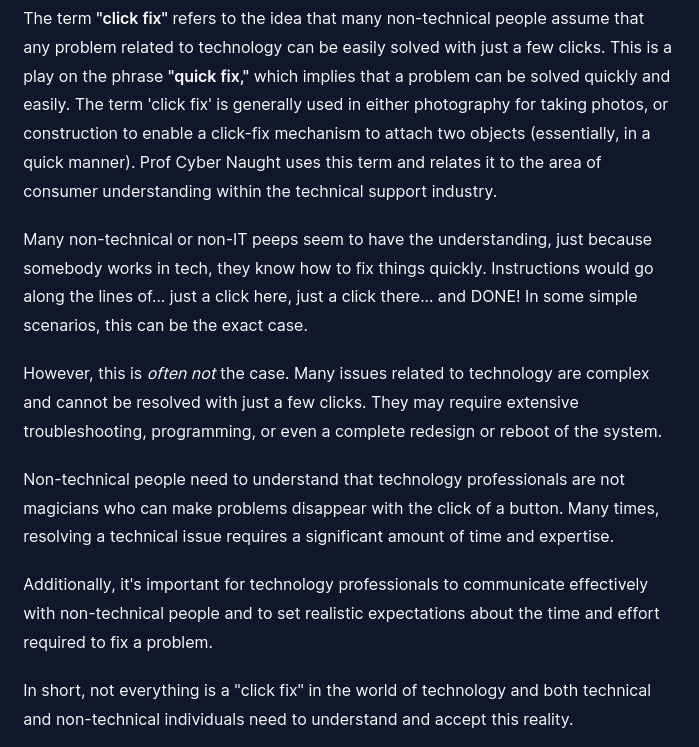

You can copy the main body content text and paste this into the `blank template file` content section displayed in the image below:

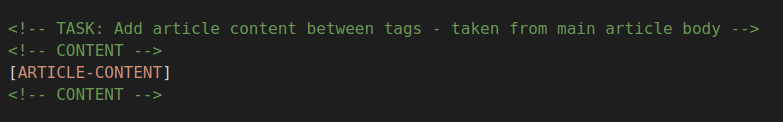

Replace `[ARTICLE-CONTENT]` with the copied body content text:

```
The term "click fix" refers to the idea that many non-technical people assume that any problem related to technology can be easily solved with just a few clicks. This is a play on the phrase "quick fix," which implies that a problem can be solved quickly and easily. The term 'click fix' is generally used in either photography for taking photos, or construction to enable a click-fix mechanism to attach two objects (essentially, in a quick manner). Prof Cyber Naught uses this term and relates it to the area of consumer understanding within the technical support industry.

Many non-technical or non-IT peeps seem to have the understanding, just because somebody works in tech, they know how to fix things quickly. Instructions would go along the lines of... just a click here, just a click there... and DONE! In some simple scenarios, this can be the exact case.

However, this is often not the case. Many issues related to technology are complex and cannot be resolved with just a few clicks. They may require extensive troubleshooting, programming, or even a complete redesign or reboot of the system.

Non-technical people need to understand that technology professionals are not magicians who can make problems disappear with the click of a button. Many times, resolving a technical issue requires a significant amount of time and expertise.

Additionally, it's important for technology professionals to communicate effectively with non-technical people and to set realistic expectations about the time and effort required to fix a problem.

In short, not everything is a "click fix" in the world of technology and both technical and non-technical individuals need to understand and accept this reality.

"Click Fix" - ProfCyberNaught
```

**IMPORTANT INSTRUCTIONS:**<br />
You must pay attention to the article content and whether or not this content has `bold text`, `italic text`, `underlined text`, potential `links` to other pages and websites, `lists`, `quotes` and more.

<ins>In our example article used above</ins>, we can see from the main article content, we have <ins>bold text twice</ins> in the first paragraph, <ins>italics</ins> in the third paragraph, and the last sentence is all <ins>bold</ins>.

#### BOLD TEXT
When trying to use bold text, we need to add characters before and after the specific text to be made bold. In order to do this, we need to use the `asterisk symbol(*)` twice as follows:

Paragraph One:
```
The term **"click fix"** refers to the idea that many non-technical people assume that any problem related to technology can be easily solved with just a few clicks. This is a play on the phrase **"quick fix,"** which implies ... ... ...
```

Last Sentence:
```
**"Click Fix" - ProfCyberNaught**
```

<ins>**IMPORTANT NOTICE ON ASTERISK USAGE**</ins>

If you need to use the `asterisk symbol(*)` but need it to be displayed in bold (__*__), you must use two `underscore symbols(__)` at the beginning and end of your text. If you try using the asterisks instead, you will break the text display formats.

An example of correct use has been presented below:

```
This sentence contains a **bold** asterisk at the end __*__
```

#### ITALIC TEXT
When trying to use italic text, we need to add characters before and after the specific text to be made italic. In order to do this, we need to use the `underscore symbol(_)` as follows:

Paragraph Three:
```
However, this is _often not_ the case. Many issues ... ... ...
```

<ins>**IMPORTANT NOTICE ON ITALIC USAGE**</ins>

If you need to use the `underscore symbol(_)` but need it to be displayed in italic ( *_* ), you must use a single `asterisk symbol(*)` at the beginning and end of your text. If you try using the underscores instead, you will break the text display formats. You might not be able to visually tell it is italic due to the nature of the character or type font.

An example of correct use has been presented below:

```
This sentence contains an _italic_ underscore at the end *_*
```

#### MIXING BOLD AND ITALIC TEXT
To emphasise text with bold and italics at the same time, add three asterisks or underscores before and after a word or phrase. To bold and italicise the middle of a word for emphasis, add three asterisks without spaces around the letters.

```
This text is ***really important***.
This text is ___really important___.
This text is __*really important*__.
This text is **_really important_**.
This is really***very***important text.
```

#### UNDERLINED TEXT
When trying to use underlined text, we need to add a tag before and after the specific text to be made underlined. In order to do this, we need to use the open `<ins>` tag before, and then the close `</ins>` tag after as follows:

```
The following is underlined: <ins>I am underlined</ins> ... ... ...
```

<ins>**IMPORTANT NOTICE:**</ins> You will see many online people discussing and using `<u>` and `</u>` to underline text; this is common HTML syntax. However, over here on GitHub, it does not work and you must use the `<ins>` and `</ins>` versions instead.

#### HEADINGS TEXT
When trying to represent heading text, we need to add a set amount of `pound symbols(#)` before our title text seperated by a single space. It is also considered good practice to add a line space above and below your heading text. This ensures there are no display issues.

We have provided example heading text syntax below:

```
# This is a article title heading (H1)
## This is a article subtitle heading (H2)
### This is a article body content heading (H3)
```

<ins>**NOTICE:**</ins> Markdown supports up to level six in relation to headings `######`. However, our articles only use up to level three.

#### NEW PARAGRAPHS
When trying to represent paragraph layouts, we need to add a line space between them.

We have provided example paragraph text below:

```
This is a paragraph containing only a few sentences. We are attempting to demonstrate how a paragraph can be written in the Markdown Syntax. When copying the article body content from the main Cybersecurity website, those paragraphs should still remain when you paste the text.

However, with this new paragraph we have left a line gap (new line) between the first paragraph and this second paragraph. This means, we do not have to use standard HTML tags such as <p></p> in order to achieve the same thing. This allows for easier copying of the main Cybersecurity articles.
```

#### LINE BREAKS TEXT
When trying to represent line breaks within your text, we need to add a tag after the line we want to break at. This is done by using `<br />` or `<br>`.

We have provided example line break text syntax below:

```
This is the first line.<br />This will appear underneath.<br />This will appear at the bottom of the two lines previously.
```

<ins>**NOTICE:**</ins> It does not matter if you place all your sentences requiring line breaks on a single line using the `<br />` syntax. They will all still appear on their own lines. However, to make content easier to read, we suggest the layout below:

```
This is the first line.<br />
This will appear underneath.<br />
This will appear at the bottom of the two lines previously.
```

#### BLOCKQUOTE TEXT
To create a blockquote, add a `greater-than symbol(>)` in front of a paragraph. An example blockquote is displayed below:

> This is a block quote for example purposes.

Here is the correct syntax to display a blockquote:

```
> ProfCyberNaught walked through many of the beautiful virtual rooms.
```

#### BLOCKQUOTES WITH MULTIPLE PARAGRAPHS:

Blockquotes can contain multiple paragraphs. Add a `greater-than symbol(>)` on the blank lines between the paragraphs.

```
> ProfCyberNaught walked through many of the beautiful virtual rooms.
>
> Suddenly, the rooms became very dark because there was a power outage.
```

#### NESTED BLOCKQUOTES:

Blockquotes can be nested. Add two `greater-than symbols(>>)` in front of the paragraph you want to nest.

```
> ProfCyberNaught walked through many of the beautiful virtual rooms.
>
>> Suddenly, the rooms became very dark because there was a power outage.
```

#### BLOCKQUOTES WITH OTHER ELEMENTS:

Blockquotes can contain other Markdown formatted elements. Not all elements can be used so you will need to experiment to see which ones work.

```
> #### The detailed instructions look great!
>
> - Helpfulness was off the chart.
> - Usage was higher than ever.
>
>  *Everything* is going according to **I have no plan**.
```

#### ORDERED LIST TEXT
To create an ordered list, add line items with numbers followed by periods. The numbers do not have to be in numerical order, but the list should start with the number one.

```
1. First item
2. Second item
3. Third item
4. Fourth item

1. First item
1. Second item
1. Third item
1. Fourth item

1. First item
8. Second item
3. Third item
5. Fourth item

1. First item
2. Second item
3. Third item
    1. Indented item (press your TAB key first)
    2. Indented item (press your TAB key first)
4. Fourth item 
```

#### UNORDERED LIST TEXT
To create an unordered list, add `hyphen symbols(-)`, `asterisks(*)`, or `plus signs(+)` in front of line items. Indent one or more items to create a nested list.

```
- First item
- Second item
- Third item
- Fourth item

* First item
* Second item
* Third item
* Fourth item

+ First item
+ Second item
+ Third item
+ Fourth item

- First item
- Second item
- Third item
    - Indented item (press your TAB key first)
    - Indented item (press your TAB key first)
- Fourth item 
```

**Starting Unordered List Items With Numbers**
If you need to start an unordered list item with a number followed by a period, you can use a `backslash symbol(\)` to escape the `period symbol(.)`.

```
- 2023\. A great year!
- I think 2024 will be better.
```

<ins>**_IMPORTANT NOTICE:_**</ins> _If you do not add the `backslash symbol(\)` to cancel out the `period symbol(.)`, you will indent your list line._

<ins>**_GOOD TIP:_**</ins> _If things do not appear the way you expect, double check that you have indented the elements in the list four spaces or one TAB key press._

Example of **GOOD TIP** below:

```
* This is the first list item.
* Here's the second list item.

    I need to add another paragraph below the second list item.

* And here's the third list item.
```

#### PROGRAMMING CODE TEXT
Below is an example of how a PHP code block looks in Markdown:

```PHP
<?php

// Start new function
function are_you_scared($scary_event) {

    // Escape provided input for security
    $did_something_happen = htmlentities($scary_event, ENT_QUOTES);

    // Start conditional statement
    if ($did_something_happen) { // Something really happened!!!

        $did_something_happen = "Scream out loud!"; // Sets response value
    }

    else { // Nothing really happened

        $did_something_happen = "No! I am bored!"; // Sets response value

    }

    return $did_something_happen; // Returns response to use
}

echo "ProfCyberNaught Takes Off Mask: " . are_you_scared("ProfCyberNaught Takes Off Mask");

?>
```

When trying to display programming code, you can either use three `backtick symbols(```)` at the beginning and end of your code snippet, or you can provide a language definition after the first three backticks ` ```php` to format the code correctly accordingly to language used.

```
```PHP
<?php

// This is a PHP comment.

$set_me_now = "new variable";

?>```
```

_If you are unsure about the language you are trying to display, please get in touch and we will help you display it correctly._

_Alternatively, checkout the following markdown website page: [Markdown Code Blocks](https://markdown.land/markdown-code-block "Markdown Code Blocks")_

#### DISPLAYING IMAGES
If the article content contains images, we will add the image files within the review process to make sure they are the correct size and format.

However, if you want to know how to add an image in Markdown, please refer to the following snippet:

```

```

**FAQ: What is ALT?**<br />
ALT stands for `Alternative Tag` and is widely used to describe an image. This helps with SEO best practices but also screenreaders, plus provides placeholder text if an image does not load. ALT tags should always be used.

#### ESCAPING BACKTICKS TEXT
If the word or phrase you want to denote as code includes one or more backticks, you can escape it by enclosing the word or phrase in double `backtick symbols(``)`.

```
``Use `code` in your Markdown file.``
```

#### HORIZONTAL RULES (LINES & DIVIDERS)
To create a horizontal rule, line or divider, use three or more `asterisk symbols(***)`, `hyphen symbols(---)`, or `underscore symbols(___)` on a line by themselves. Make sure you have a line break above and below the horizontal rule.

```
Try to put a blank line before...

---

...and after a horizontal rule. 
```

#### ADDING LINKS
When adding links, we insist on using a certain format that incorporates best SEO practices (Search Engine Optimsation - SEO). The link must contain the text to display, the url (must be encrypted using HTTPS only), and a link title.

Below is an example:

```
[Text To Display Here](https://your-url-link-here.com "Link Title Here")
```

- **Text To Display**: This is what is visable on the screen.<br />
- **Your URL Link Here**: This is the url link to the website page (using https)<br />
- **Link Title Here**: This displays when someone hovers over and search engines use this<br />

<ins>**NOTICE ABOUT URLS:**</ins> All URLs must be in the format mentioned above. We do not accept the minimum standard of using `less-than symbols(<)` and `more-than symbols(>)` like this `<https://your-link-goes-here.com>`.

#### ESCAPING CHARACTERS
Sometimes, we need to use certain characters in our text that are certainly going to cause some Markdown layout rendering. We must use the `backslash symbol(\)` to escape the character and stop Markdown from rendering it a display instruction.

Here is an example of using an `asterisk symbol(*)` within the text:

```
\* Without the backslash, this would be a bullet in an unordered list.
```

The following symbols can be escaped: \` \\ \* \_ \{} \[] \<> \() \# \+ \- \. \! \|

#### USING TABLES
Sometimes, we need to use tables to layout the information. There is a specific way tables work within Markdown and we provide examples below:

Table Column Headers:
```
| COLUMN HEADER 1 | COLUMN HEADER 2 | COLUMN HEADER 3 |
```

We then need to `divider` them:
```
| COLUMN HEADER 1 | COLUMN HEADER 2 | COLUMN HEADER 3 |
| --------------- | --------------- | --------------- |
```

We can then add our rows of data:

```
| COLUMN HEADER 1 | COLUMN HEADER 2 | COLUMN HEADER 3 |
| --------------- | --------------- | --------------- |
|    ROW1 COL1    |    ROW1 COL2    |    ROW1 COL3    |
|    ROW2 COL1    |    ROW2 COL2    |    ROW2 COL3    |
|    ROW3 COL1    |    ROW3 COL2    |    ROW3 COL3    |
```

An example of how the table looks has been presented below:

| COLUMN HEADER 1 | COLUMN HEADER 2 | COLUMN HEADER 3 |
| --------------- | --------------- | --------------- |
|    ROW1 COL1    |    ROW1 COL2    |    ROW1 COL3    |
|    ROW2 COL1    |    ROW2 COL2    |    ROW2 COL3    |
|    ROW3 COL1    |    ROW3 COL2    |    ROW3 COL3    |

You can add into your table different Markdown data types _(the `blank article template file` uses this method in the footer table)_.

Just experiment and see if you gain the look you need to match the Cybersecurity Blog Article. If you struggle, give us a comment on the repository issue.

<br />


**FAQ: What about other content types?**<br />
If there are other types of content within your chosen article, it would be best to refer to the [Basic Syntax - Markdown Guide](https://www.markdownguide.org/basic-syntax/ "Basic Syntax - Markdown Guide") linked above. This covers many different methods of adding content types using Markdown. However, we have tried to include most options here.
<br /><br />

#### THE ARTICLE KEYWORDS
The article keywords can be found directly underneath the main article content. The below image displays the keywords section of an article page named: `Not Everything is a 'Click Fix'!`. [View Article](https://profcybernaught.hashnode.dev/not-everything-is-a-click-fix "Not Everything is a 'Click Fix'! - Cybersecurity Blog - ProfCyberNaught")

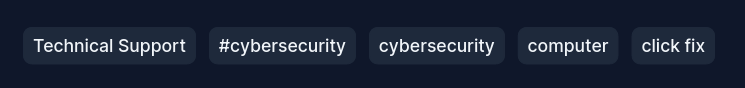

You can copy each individual keyword and paste them into the `blank template file` keyword fields section displayed in the image below:

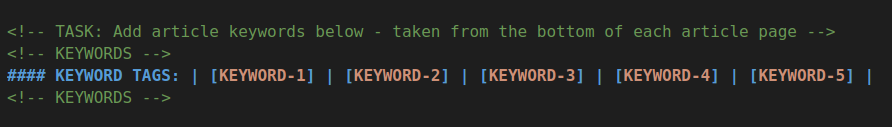

Replace `[KEYWORD-1]` and the other four with the copied keyword text:

```
#### KEYWORD TAGS: | Technical Support | #cybersecurity | cybersecurity | computer | click fix |
```
<ins>**_KEYWORD NOTICE:_**</ins> _Some keywords might look like they are repeated but using the `pound symbol(#)`, also commonly known as the `hash symbol(#)` on social media, or the `money symbol(#)` elsewhere. This is not a typo and refers to a different registered keyword type on the Hashnode website platform. As such, as in our example above, please make sure you still copy these including the symbol.<br /><br />
__*__ **All articles will contain five keywords in total!**_
<br /><br />

#### THE ARTICLE REFERENCES (FURTHER READING)
The article references section _(if your chosen article has one)_ can be found directly above the keyword section. The below image displays the reference section of an article page named: `An Overview of Leet (1337) Speak: History, Usage, and Implications`. [View Article](https://profcybernaught.hashnode.dev/an-overview-of-leet-1337-speak-history-usage-and-implications "An Overview of Leet (1337) Speak: History, Usage, and Implications - Cybersecurity Blog - ProfCyberNaught")

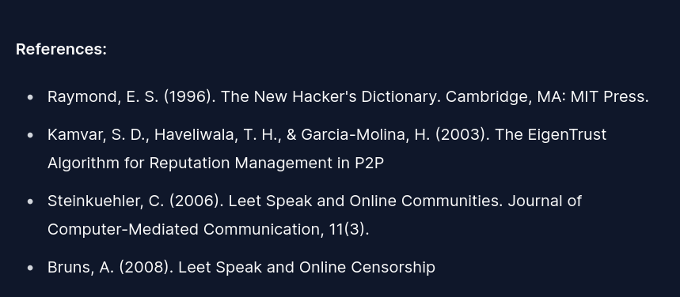

The reference section normally uses a an unordered list format and can be accomplished in Markdown by adding a `hyphen symbol(-)` at the beginning of each reference line used.

You can copy the reference text and paste this into the `blank template file` reference section displayed in the image below:

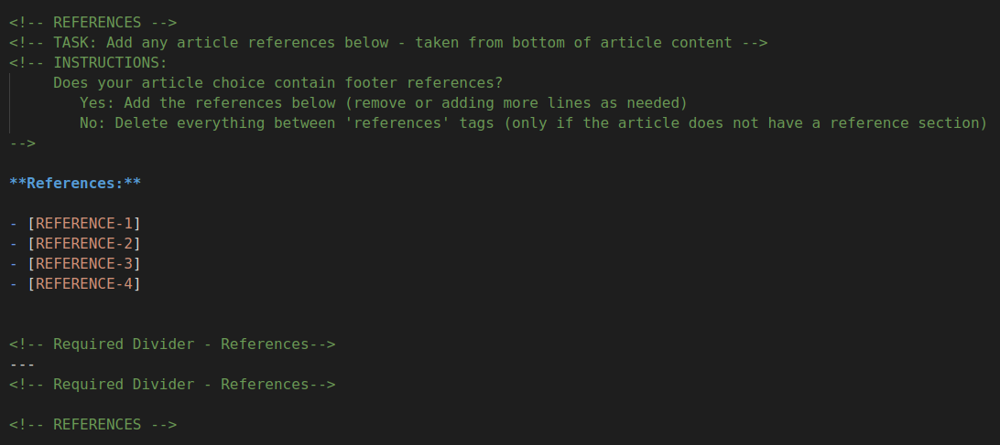

Replace `[REFERENCE-1]` with the first copied reference text, and repeat for as many as you need. We have provided four placeholders `[REFERENCE-X]` within the template. However, just add more using the `hyphen symbol(-)` when needed. Here is what our example reference section looks like from the article used for demonstration purposes:

```
- Raymond, E. S. (1996). The New Hacker's Dictionary. Cambridge, MA: MIT Press.
- Kamvar, S. D., Haveliwala, T. H., & Garcia-Molina, H. (2003). The EigenTrust Algorithm for Reputation Management in P2P
- Steinkuehler, C. (2006). Leet Speak and Online Communities. Journal of Computer-Mediated Communication, 11(3).
- Bruns, A. (2008). Leet Speak and Online Censorship
```

<ins>**_NOTICE:_**</ins> _There must be a space between the `hyphen symbol(-)` used and the beginning of the reference text. This can be see in the `blank template file`._

**FAQ: What if my chosen article does not have a reference section?**<br />
If your chosen article does not contain any references, as per the commented instructions with the `blank template file`, you can delete all content between the reference tags: `<!-- REFERENCES -->` _(including the tags themselves)_.

<br /><br />

#### THE BLANK TEMPLATE FOOTER TABLE
The `blank template file` contains a table at the bottom which contains all the important information about the article, and yourself _(the person who copied the article over from the main Cybersecurity website)_. All copied articles must have this table populated with the correct data, including a link to your very own GitHub profile page.

Here is what the Footer Table looks like within the `blank template file`:

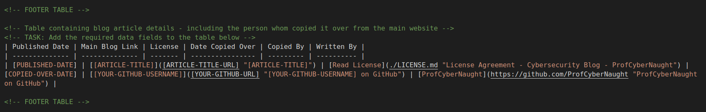

<ins>**_HELP NOTICE:_**</ins> _This is where many beginner contributors struggle. We have tried to provide as much detail as possible. However, if you still find yourself struggling, please leave a comment on the repository issue, and we will get back to you and provide additional support if required._

Within this footer table, we use some variable placeholders to help you place your copied data into the correct locations. These consist of the following:

- `[PUBLISHED-DATE]`
- `[[ARTICLE-TITLE-HERE]]`
- `[ARTICLE-TITLE-URL]`
- `[COPIED-OVER-DATE]`
- `[[YOUR-GITHUB-URL-USERNAME]]`
- `[YOUR-GITHUB-URL]`

#### SETTING THE 'PUBLISHED-DATE' VARIABLE
The published date can be found by looking at the header of the chosen Cybersecurity article. This is normally displayed in the following format: `Jan 22, 2023`.

Simply, replace `[PUBLISHED-DATE]` with the correct date by copying the date and pasting into the `blank template file`. An example of what the table should look like so far has been provided below:

```
| Jan 22, 2023 | [[ARTICLE-TITLE-HERE]]([ARTICLE-TITLE-URL] "[ARTICLE-TITLE-HERE]") | [Read License](./LICENSE.md "License Agreement - Cybersecurity Blog - ProfCyberNaught") | [COPIED-OVER-DATE] | [[YOUR-GITHUB-USERNAME]]([YOUR-GITHUB-URL] "[YOUR-GITHUB-USERNAME] on GitHub") | [ProfCyberNaught](https://github.com/ProfCyberNaught "ProfCyberNaught on GitHub") |
```

#### SETTING THE 'ARTICLE-TITLE-HERE' VARIABLES
The article title can be found by looking at the header of the chosen Cybersecurity article. This is normally displayed at the very top. we have already covered this in a previous instruction above.

You will notice, this variable placeholder has two sets of `square brackets[[ ]]`. This is not a typo but simply a function of the Markdown syntax. When adding your copied data, you must leave the first set of `square brackets[]` intact.

Here is an example of what the table should look like using our example Cybersecurity article data:

```
| Jan 22, 2023 | [Not Everything is a 'Click Fix'!]([ARTICLE-TITLE-URL] "[ARTICLE-TITLE-HERE]") | [Read License](./LICENSE.md "License Agreement - Cybersecurity Blog - ProfCyberNaught") | [COPIED-OVER-DATE] | [[YOUR-GITHUB-USERNAME]]([YOUR-GITHUB-URL] "[YOUR-GITHUB-USERNAME] on GitHub") | [ProfCyberNaught](https://github.com/ProfCyberNaught "ProfCyberNaught on GitHub") |
```

Notice the data still has the first square brackets as follows: `[Not Everything is a 'Click Fix'!]`.

We have another instance of the `[ARTICLE-TITLE-HERE]` but this time, it only has one set of `square brackets[]`. Again, this is intentional and you need to replace the variable placeholder _(including the brackets this time)_ with your article title.

An example of what the footer table should look like with the above changes has been provided below:

```
| Jan 22, 2023 | [Not Everything is a 'Click Fix'!]([ARTICLE-TITLE-URL] "Not Everything is a 'Click Fix'!") | [Read License](./LICENSE.md "License Agreement - Cybersecurity Blog - ProfCyberNaught") | [COPIED-OVER-DATE] | [[YOUR-GITHUB-USERNAME]]([YOUR-GITHUB-URL] "[YOUR-GITHUB-USERNAME] on GitHub") | [ProfCyberNaught](https://github.com/ProfCyberNaught "ProfCyberNaught on GitHub") |
```

#### SETTING THE 'COPIED-OVER-DATE' VARIABLE
This refers to the date you copied over the Cybersecurity article. If todays date is currently _'Wednesday the 15th March 2023'_, then you would need to replace the variable placeholder with `Mar 15, 2023`.

Here is an example of what the table should look like with all the steps completed so far:

```
| Jan 22, 2023 | [Not Everything is a 'Click Fix'!]([ARTICLE-TITLE-URL] "Not Everything is a 'Click Fix'!") | [Read License](./LICENSE.md "License Agreement - Cybersecurity Blog - ProfCyberNaught") | Mar 15, 2023 | [[YOUR-GITHUB-USERNAME]]([YOUR-GITHUB-URL] "[YOUR-GITHUB-USERNAME] on GitHub") | [ProfCyberNaught](https://github.com/ProfCyberNaught "ProfCyberNaught on GitHub") |
```

#### SETTING THE 'ARTICLE-TITLE-URL' VARIABLE
This refers to the website link url which is displayed in the address bar of your internet browser for the main Cybersecurity website. Here is what it should look like for our example Cybersecurity article:

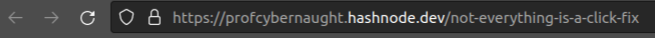

You will need to copy this link _(making sure it starts with the `https`)_ and replace the variable placeholder `[ARTICLE-TITLE-URL]`.

Here is an example of what the table should look like with all the steps completed so far:

```
| Jan 22, 2023 | [Not Everything is a 'Click Fix'!](https://profcybernaught.hashnode.dev/not-everything-is-a-click-fix "Not Everything is a 'Click Fix'!") | [Read License](./LICENSE.md "License Agreement - Cybersecurity Blog - ProfCyberNaught") | Mar 15, 2023 | [[YOUR-GITHUB-USERNAME]]([YOUR-GITHUB-URL] "[YOUR-GITHUB-USERNAME] on GitHub") | [ProfCyberNaught](https://github.com/ProfCyberNaught "ProfCyberNaught on GitHub") |
```

#### SETTING THE 'YOUR-GITHUB-USERNAME' VARIABLES
This is where you get to place your own GitHub profile account name. This is our way of saying thank you for taking the time to contribute to this repository, and copying over an article written by ProfCyberNaught from the main Cybersecurity website.

If you visit your GitHub profile page, you will see your account profile username in the address bar. For ProfCyberNaught, we have included an example screenshot of the address bar for the GitHub profile account page:


You will need to copy everything after `https://github.com/` which for ProfCyberNaught's profile link, should look like this: `ProfCyberNaught` and replace the variable placeholders `[[YOUR-GITHUB-USERNAME]]`, and `[YOUR-GITHUB-USERNAME]`.

<ins>**Remember**</ins> the double `square brackets[[ ]]` from ealier?

The first instance of the variable placeholder has the double `square brackets[[ ]]` again. Make sure you leave the first set of square brackets intact as follows: `[ProfCyberNaught]`.

The second instance only has a single set of `square brackets[]` and must be replaced as follows: `ProfCyberNaught`.

Here is an example of what the table should look like with all the steps completed so far:

```
| Jan 22, 2023 | [Not Everything is a 'Click Fix'!](https://profcybernaught.hashnode.dev/not-everything-is-a-click-fix "Not Everything is a 'Click Fix'!") | [Read License](./LICENSE.md "License Agreement - Cybersecurity Blog - ProfCyberNaught") | Mar 15, 2023 | [ProfCyberNaught]([YOUR-GITHUB-URL] "ProfCyberNaught on GitHub") | [ProfCyberNaught](https://github.com/ProfCyberNaught "ProfCyberNaught on GitHub") |
```

#### SETTING THE 'YOUR-GITHUB-URL' VARIABLE
This should be a simple task considering we have just looked at the GitHub profile URL in the above step. This time, you will need to copy the whole URL and replace the `[YOUR-GITHUB-URL]` variable placeholder.


You will need to copy everything which should look like this: `https://github.com/ProfCyberNaught` and replace the variable placeholder `[YOUR-GITHUB-URL]`.

Here is an example of what the table should look like with all the steps completed for the footer table:

```
| Jan 22, 2023 | [Not Everything is a 'Click Fix'!](https://profcybernaught.hashnode.dev/not-everything-is-a-click-fix "Not Everything is a 'Click Fix'!") | [Read License](./LICENSE.md "License Agreement - Cybersecurity Blog - ProfCyberNaught") | Mar 15, 2023 | [ProfCyberNaught](https://github.com/ProfCyberNaught "ProfCyberNaught on GitHub") | [ProfCyberNaught](https://github.com/ProfCyberNaught "ProfCyberNaught on GitHub") |
```
Clearly, where we have been using ProfCyberNaught's GitHub profile in our examples above, you need to be using your own GitHub profile username and url data.

_Please <ins>do not change anything else in the footer table</ins> but only the variable placeholders as mentioned above._

_Your <ins>GitHub username must match your url username</ins> and cannot be changed or represented in a different way._

_We may add a link to the ProfCyberNaught GitHub profile page next to yours representing who copied the article over when the review takes place. This depends on how much assistance and changes we need to make on your behalf._
<br /><br />

#### DO NOT EDIT ABOVE OR BELOW SECTIONS
The `blank template file` contains two sections that highlight areas that must not be edited above or below. This is because the content provides important navigation links for visitors to the page you are creating.

Here is an example of the `DO NOT EDIT ABOVE THIS LINE`:

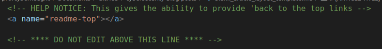

Here is an example of the `DO NOT EDIT BELOW THIS LINE`:

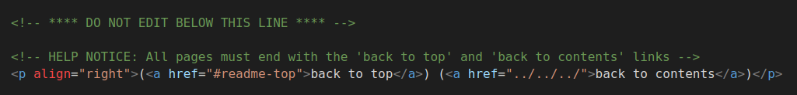

<ins>**_IMPORTANT NOTICE:_**</ins> _If you edit anything within these sections, or remove them, the navigations on the page you are creating will not work. We will not accept copied articles with these sections removed or changed. We will leave feedback as part of the review process asking for changes to be made._

_We will try to be as helpful as we can when assisting with your support requests._

<br /><br />

#### NEXT STEPS

Now you have hopefully copied over all the required content and placed this within the `blank_article_layout_template.md` file we used above. **Remember**, make sure you have copied the template file, renamed it, and left the original template file in the repository for others to use.

You now need to refer to the [CONTRIBUTING.md](./CONTRIBUTING.md "Contributing to Copy a Cybersecurity Blog Article - ProfCyberNaught - GitHub Backup Repository") file and continue with the following step: `UPDATE TODO.md FILE`.
<br />
<p align="right">(<a href="#readme-top">back to top</a>)</p>
<br />

#### Support

If you need support whilst you are creating your new copied article data, or following the detailed steps provided above, please `leave a comment on your issue`. We will try advise as much as we can to allow you to successfully complete your pull request.
<br />
<p align="right">(<a href="#readme-top">back to top</a>)</p>
<br />


Code of Conduct
===============

As a `contributor`, you can help us keep our community open and inclusive.
Please read and follow our [Code of Conduct](./code_of_conduct.md "Code of Conduct - Cybersecurity Blog Posts") 

<!-- HELP NOTICE: All pages must end with the 'back to top' and 'back to contents' links -->
<p align="right">(<a href="#readme-top">back to top</a>) (<a href="../../">back to contents</a>)</p>
